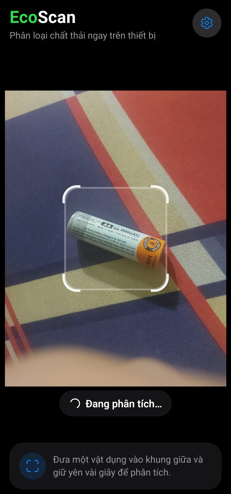
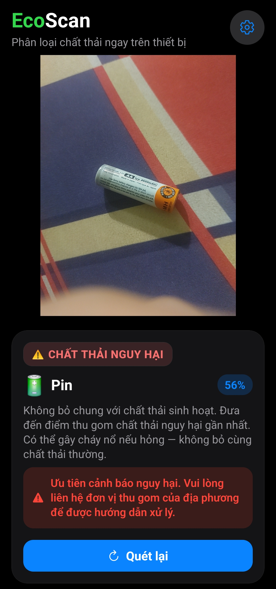

# EcoScan

Ứng dụng di động giúp **nhận diện và phân loại chất thải** ngay trên điện thoại, không cần internet, không tải ảnh lên thiết bị khác. Toàn bộ quá trình nhận diện diễn ra cục bộ trên máy của bạn.

| Đang phân tích | Kết quả nhận diện |
|:---:|:---:|
|  |  |

## App nhận diện được gì?

Model AI tích hợp sẵn trong app nhận diện được **10 loại chất thải**:

| Nhóm | Loại |
|:---|:---|
| Tái chế | Giấy, bìa cứng, nhựa, kim loại, thủy tinh |
| Thực phẩm | Chất thải hữu cơ (thức ăn thừa, vỏ trái cây...) |
| Nguy hại | Pin |
| Khác | Quần áo, giày dép, chất thải thông thường |

Mỗi kết quả hiển thị **phần trăm độ tin cậy của model** (ví dụ "Pin — 56%"), cho biết mức độ chắc chắn của nhận diện.

> **Lưu ý quan trọng:** Kết quả do model AI dự đoán nên **không hoàn toàn chính xác 100%**. Hãy xem phần trăm tin cậy kèm theo: số càng cao thì khả năng nhận diện đúng càng lớn. Với vật thể mới lạ hoặc điều kiện ánh sáng kém, model có thể nhận diện sai — khi đó hãy đưa vật thể vào khung gần hơn, đủ sáng và quét lại.

## Tính năng

- Đưa vật thể vào khung camera → app tự nhận diện loại chất thải và gợi ý cách xử lý
- Kết quả hiển thị bằng tiếng Việt với hướng dẫn ngắn gọn cho từng loại
- Kết quả được xếp vào 4 nhóm: **tái chế**, **thực phẩm**, **chất thải nguy hại**, **chất thải khác**, kèm cảnh báo riêng cho vật nguy hại
- Camera tự đứng yên sau khi quét xong, bấm **Quét lại** để tiếp tục
- Không cần đăng nhập, không thu thập dữ liệu cá nhân

## Sử dụng

1. Mở app và cấp quyền truy cập camera
2. Đặt vật thể vào khung vuông giữa màn hình, giữ yên trong vài giây
3. Xem kết quả, phần trăm tin cậy và gợi ý phân loại
4. Bấm **Quét lại** để nhận diện vật khác

> Nếu app hiển thị "Chưa chắc chắn", hãy đưa vật thể gần hơn và ở nơi đủ sáng.

## Cài đặt cho lập trình viên

```bash
npm install
```

> **Lưu ý:** App dùng module native cho AI nên không chạy được trong Expo Go.
> Phải dùng Development Build.

```bash
# Build và chạy Development Build lên thiết bị Android
npx expo prebuild --platform android
npx expo run:android

# Build APK release
cd android && ./gradlew assembleRelease
```

## Cấu trúc code

```
src/
  app/                 # Màn hình: quét chính, cài đặt
  components/          # Các thành phần giao diện
  data/                # Tên gọi, nhóm phân loại và ngưỡng nhận diện (chỉnh được không cần huấn luyện lại)
  hooks/               # Logic quét và nhận diện
```

## Lưu ý

- Kết quả chỉ mang tính tham khảo, không thay thế quy định phân loại rác tại địa phương
- Luôn bỏ pin riêng vào điểm thu gom chất thải nguy hại
